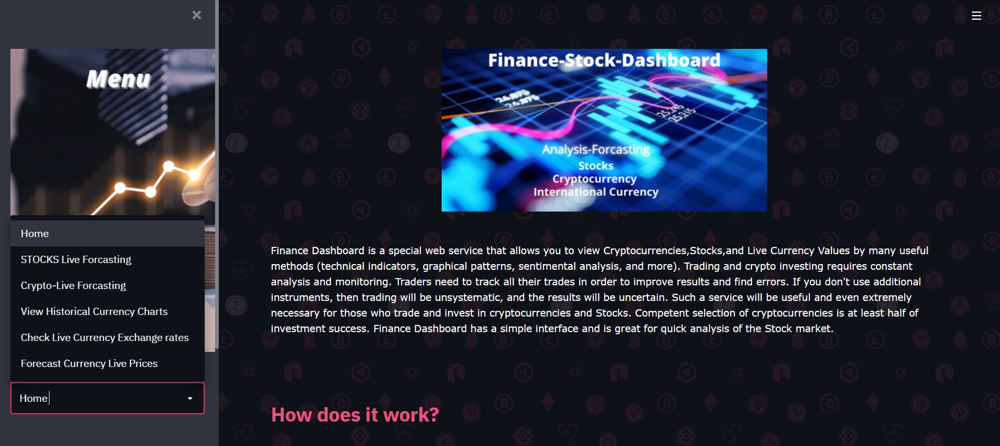
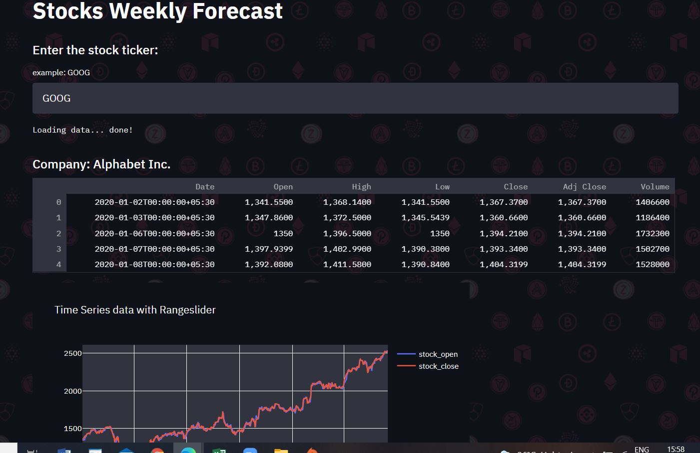
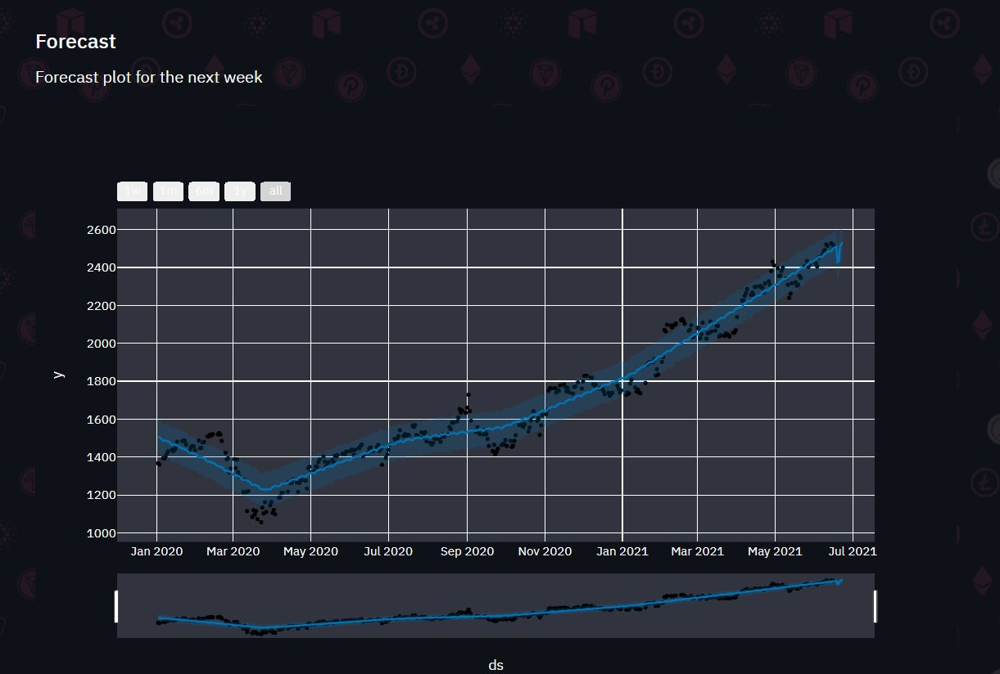
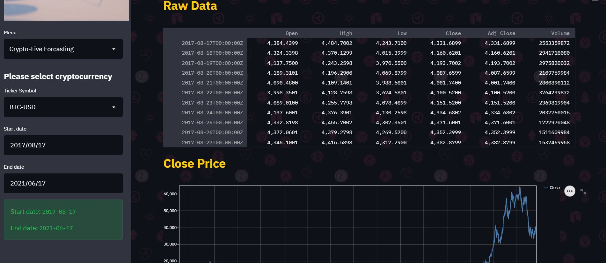
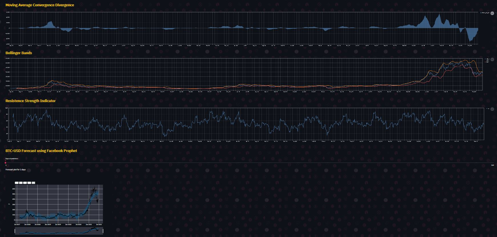
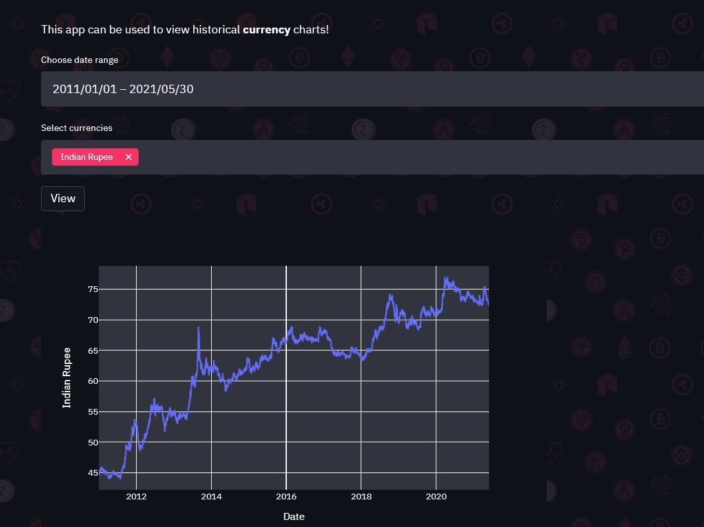

# • Do ⭐ the repository if it helped you in anyway.
# Finance-Forcasting-Dashboard
Finance Dashboard is a special web service that allows you to view Cryptocurrencies,Stocks,and Live Currency Values by many useful methods (technical indicators, graphical patterns, sentimental analysis, and more). Trading and crypto investing requires constant analysis and monitoring. Traders need to track all their trades in order to improve results and find errors. If you don't use additional instruments, then trading will be unsystematic, and the results will be uncertain. Such a service will be useful and even extremely necessary for those who trade and invest in cryptocurrencies and Stocks. Competent selection of cryptocurrencies is at least half of investment success. Finance Dashboard has a simple interface and is great for quick analysis of the Stock market.

# Stocks Weekly Forecast

# Crypto Weekly Forecast

# Historical Currency Chart

# LIVE Currency Exchange Rate

